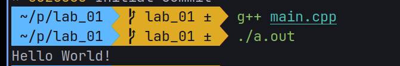

**Ministry of Education and Science of Ukraine**

**National Technical University "KhPI"**

**Educational and Scientific Instutute of Computer Science and Informational Technology**

**_Department of Computer Engineering and Programming_**

**Course:** **_Programming. Part1_**

**REPORT** on the laboratory work #1

**Topic:** _"Basics of Setting Up Development Environment"_

> **_Prepared by:_**
>
> Student of group KN-924e Nikita Afanasiev.

> **_Checked by:_**
>
> Associate Professor _Volodymyr SAVCHENKO_

# KHARKIV 2024

---

## Task 1

### Explanation

> To configure the development environment, install the necessary tools and write some code in C++. Compile it.

### Command performed

```bash
yay -S gcc make cmake ...
git checkout -b lab_01
mkdir lab_01
mkdir lab_01/assets
nvim lab_01/main.cpp
g++ lab_01/main.cpp
./a.out > output.txt
nvim lab_01/report.md
git add .
git commit -m "feat: readme.md rewrite"
git push lab_01
```

## Algorithm

1. Installed gcc && g++ && make && cmake etc.
2. Wrote simple C++ program to display "Hello World".
3. Compiled it using g++.
4. Using `./a.out > output.txt` redirected output to file.

> 

## Tools

- OS: `EndeavourOS`
- Compiler: `g++`
- Editor: `NeoVim`
