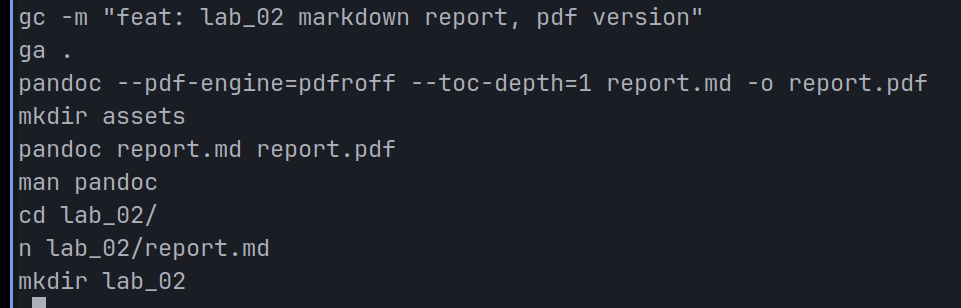

**Ministry of Education and Science of Ukraine**

**National Technical University "KhPI"**

**Educational and Scientific Instutute of Computer Science and Informational Technology**

**_Department of Computer Engineering and Programming_**

**Course:** **_Programming. Part1_**

**REPORT** on the laboratory work #2

**Topic:** _"Basics of Markdown for Technical Reports"_

> **_Prepared by:_**
>
> Student of group KN-924e Nikita Afanasiev.

> **_Checked by:_**
>
> Associate Professor _Volodymyr SAVCHENKO_

# KHARKIV 2024

---

## Task 1

### Explanation

> To understand how to work with markdown and how to create a technical report using it.

### Algorithm



> 1. Create a new branch for the task.
> 2. Create a new directory for the task.
> 3. Create a assets directory for images.
> 4. Create a report.md file.
> 5. Write a report in markdown.
> 6. Add screenshots to the assets directory.
> 7. Add images to the report.
> 8. Convert the report to pdf.
> 9. Push the changes to the repository.

### Command performed

```bash
git checkout -b lab_02
mkdir lab_02
mkdir lab_02/assets
touch lab_02/report.md
nvim lab_02/report.md
pandoc --pdf-engine=pdfroff --toc-depth=1 report.md -o report.pdf
git add .
git commit -m "feat: lab_02"
git push lab_02
```
