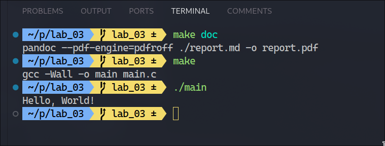

**National Technical University "KhPI"**

**Educational and Scientific Instutute of Computer Science and Informational Technology**

**_Department of Computer Engineering and Programming_**

**Course:** **_Programming. Part1_**

**REPORT** on the laboratory work #3

**Topic:** _"Building and Debugging a Simple C Project"_

> **_Prepared by:_**
>
> Student of group KN-924e Nikita Afanasiev.

> **_Checked by:_**
>
> Associate Professor _Volodymyr SAVCHENKO_

# KHARKIV 2024

---

## Task 3

### Explanation

> To configure the development environment, write some code in C, and compile it using a Makefile.

### Command performed

```bash
yay -S gcc make pandoc gdb
git checkout -b lab_03
mkdir lab_03
nvim lab_03/main.c
nvim lab_03/Makefile
make all
./main > output.txt
make doc
make debug
nvim lab_03/report.md
git add .
git commit -m "feat: report.md for lab_03"
git push lab_03
```

## Algorithm

1. Created a Makefile to automate the build process.
2. Compiled the program using `make all`.
3. Redirected the output to a file using `./main > output.txt`.
4. Created MD report.
5. Generated a PDF report from the markdown file using `make doc`.
6. Debugged the program using `make debug`.

> 

## Tools

- OS: `EndeavourOS`
- Compiler: `gcc`
- Editor: `VS Code`
- Build System: `Make`
- Documentation: `Pandoc`
- Debugger: `gdb`