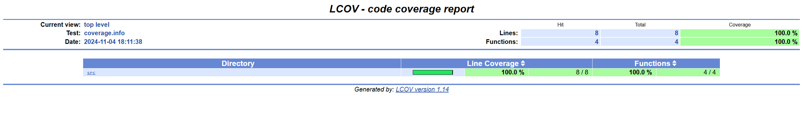

**Ministry of Education and Science of Ukraine**

**National Technical University "KhPI"**

**Educational and Scientific Instutute of Computer Science and Informational Technology**

**_Department of Computer Engineering and Programming_**

**Course:** **_Programming. Part1_**

**REPORT** on the laboratory work #6

**Topic:** _"Implementing a Function Library with Unit Testing"_

> **_Prepared by:_**
>
> Student of group KN-924e Nikita Afanasiev.

> **_Checked by:_**
>
> Associate Professor _Volodymyr SAVCHENKO_

# KHARKIV 2024

---

## Task 6

### Explanation

> To implement unit tests for a C library using the Unity framework.

### Command performed
```bash
git clone git@github.com:ThrowTheSwitch/Unity.git
...
make 
make test
./main
./run_tests
make coverage
make clean
```


### Algorithm
1. Implemented the mathematical expressions as functions in a library
    * Created a header file lib.h in the include directory with function prototypes.
    * Implemented the functions in lib.c in the src directory.
2. Created a unit test for each function using the Unity framework
    * Cloned Unity framework files to the project.
    * Created test cases for each function in test_lib.c in the test directory.
    * Used Unity macros to assert expected outcomes.
3. Configure the project structure and Makefile to build the library, main application, and test suite
    * Organized the project structure with src, include, and test directories.
    * Wrote a Makefile to compile the library, main application, and test suite.
    * Ensured the Makefile includes targets for building the library, main application, and running tests.
4. Generated a coverage report and include a screenshot of it in the final report
    * Configured the Makefile to generate coverage data using gcov or lcov.
    * Ran the tests to generate coverage data.
    * Generated a coverage report and take a screenshot.
    * Included the screenshot in the final report.

> 


Tools: 
- OS: `Ubuntu`
- Editor: `VS Code`