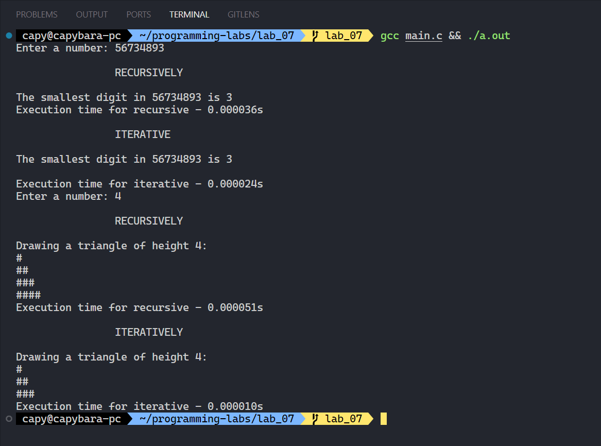

**Ministry of Education and Science of Ukraine**

**National Technical University "KhPI"**

**Educational and Scientific Instutute of Computer Science and Informational Technology**

**_Department of Computer Engineering and Programming_**

**Course:** **_Programming. Part1_**

**REPORT** on the laboratory work #7

**Topic:** _"Recursion"_

> **_Prepared by:_**
>
> Student of group KN-924e Nikita Afanasiev.

> **_Checked by:_**
>
> Associate Professor _Volodymyr SAVCHENKO_

# KHARKIV 2024

---

## Task 7

### Explanation

> To solve one task from each category using recursion.

### Command performed

```bash
mkdir lab_07
cd lab_07
code .
# some magic
gcc main.c && ./a.out
```

> 

## Tools

- OS: `WSL Ubuntu`
- Compiler: `gcc`
- Editor: `VS Code`
