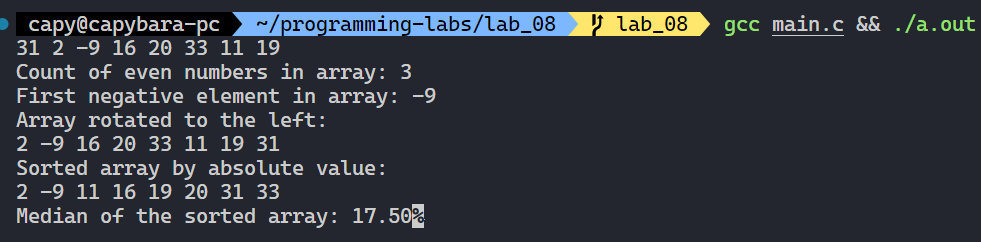

**Ministry of Education and Science of Ukraine**

**National Technical University "KhPI"**

**Educational and Scientific Instutute of Computer Science and Informational Technology**

**_Department of Computer Engineering and Programming_**

**Course:** **_Programming. Part1_**

**REPORT** on the laboratory work #8

**Topic:** _"One-Dimensional Array Exercises"_

> **_Prepared by:_**
>
> Student of group KN-924e Nikita Afanasiev.

> **_Checked by:_**
>
> Associate Professor _Volodymyr SAVCHENKO_

# KHARKIV 2024

---

## Task 8

### Explanation

> To implement functions that work with arrays.

### Command performed

```bash
mkdir lab_08
cd lab_08
...
gcc main.c && ./a.out
```

## Algorithm

1. Created directory and main file for the laboratory work.
2. Realized generate and print array functions.
3. Realized each functions in the order.

> 

## Tools

- OS: `WSL Ubuntu`
- Compiler: `gcc`
- Editor: `VS Code`
