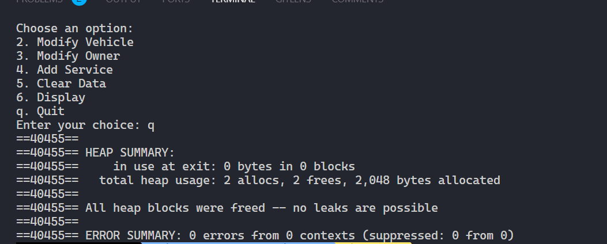

**Ministry of Education and Science of Ukraine**

**National Technical University "KhPI"**

**Educational and Scientific Institute of Computer Science and Informational Technology**

**_Department of Computer Engineering and Programming_**

**Course:** **_Programming. Part1_**

**REPORT** on the laboratory work #11

**Topic:** _"Structs in C"_

> **_Prepared by:_**
>
> Student of group KN-924e Nikita Afanasiev.

> **_Checked by:_**
>
> Associate Professor _Volodymyr SAVCHENKO_

# KHARKIV 2024

---

## Task 11

### Explanation

> Develop a Vehicle Management System in C that allows users to register vehicles, add service records, modify vehicle and owner information, and display vehicle details along with service history.

### Commands Performed

```bash
mkdir lab_11
cd lab_11
code .
# some magic
make
valgrind --leak-check=full -s ./main
make clean
```

> 

## Tools

- OS: `WSL Ubuntu`
- Compiler: `gcc`
- Editor: `VS Code`
